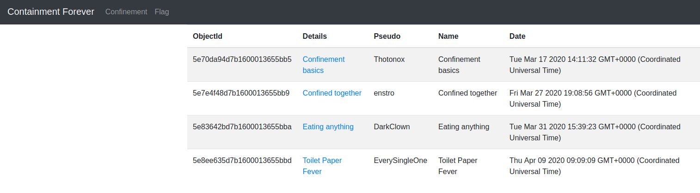
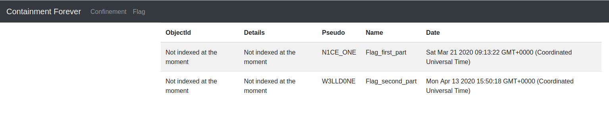
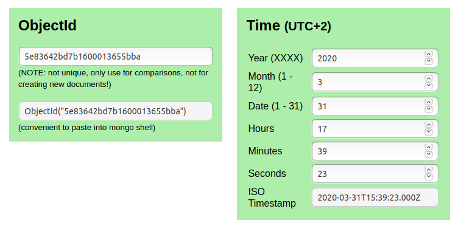
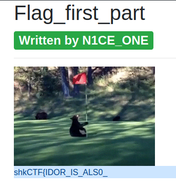
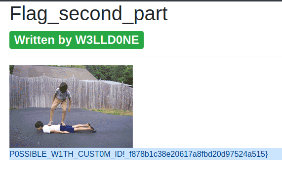

# [Web] Containment Forever (300pts)

### Description

Hello, welcome on “Containment Forever”! There are 2 categories of posts, only the first is available, get access to the posts on the flag category to retrieve the flag.

http://containment-forever.sharkyctf.xyz

Creator : Remsio

### TL;DR

The challenge consisted to predict the ObjectId from timestamp informations to get access to both parts of the flag.

### Walkthrough 

The site looks like an array with: ObjectID / Details / Pseudo / Name / Date.  

Posts can be accessed by ID : http://containment-forever.sharkyctf.xyz/item/5e83642bd7b1600013655bba

Here, Date is so important for the rest of the challenge.



By increment identifiers in the URL, we got few informations caused by verbose errors :

```
TypeError: /app/views/item.ejs:28
    26|     </nav>
    27|     <div class="container">
 >> 28|       <h1><%= item.name %></h1>
    29|       <h2><span class="badge badge-success">Written by <%= item.pseudo %></span></h2>
    30|       <hr>
    31|       "/>

Cannot read property 'name' of null
    at eval (/app/views/item.ejs:12:31)
    at item (/app/node_modules/ejs/lib/ejs.js:679:17)
    at tryHandleCache (/app/node_modules/ejs/lib/ejs.js:272:36)
    at View.exports.renderFile [as engine] (/app/node_modules/ejs/lib/ejs.js:478:10)
    at View.render (/app/node_modules/express/lib/view.js:135:8)
    at tryRender (/app/node_modules/express/lib/application.js:640:10)
    at Function.render (/app/node_modules/express/lib/application.js:592:3)
    at ServerResponse.render (/app/node_modules/express/lib/response.js:1012:7)
    at Item.findOne (/app/index.js:78:9)
    at /app/node_modules/mongoose/lib/model.js:4889:16
    at /app/node_modules/mongoose/lib/model.js:4889:16
    at /app/node_modules/mongoose/lib/helpers/promiseOrCallback.js:24:16
    at /app/node_modules/mongoose/lib/model.js:4912:21
    at _hooks.execPost (/app/node_modules/mongoose/lib/query.js:4380:11)
    at /app/node_modules/kareem/index.js:135:16
    at process._tickCallback (internal/process/next_tick.js:61:11)
```

We got informations about Stack : 
- Language : Javascript
- Backend : NodesJS and Express Library
- ORM : Mongoose library for MongoDB database.
- Function : ```Item.findOne``` indicates that the query is giving back only one document, probably based on the ObjectId.  

In the flag section, we retrieve flag posts with Date informations:




### MongoDB Documentation 
> From the official mongodb documentation :  
> The 12-byte ObjectId value consists of:
> - a 4-byte timestamp value, representing the ObjectId’s creation, measured in seconds since the Unix epoch
> - a 5-byte random value
> - a 3-byte incrementing counter, initialized to a random value


From those informations, we understand that we can easily get the first part of the ObjectId thanks to the Date given on the informations about the flags posts.
And the last part, i can bruteforce it.

For timestamp recovery, i used this tool : https://steveridout.github.io/mongo-object-time/  



So we can easily retrieve ObjectID...

> ALERT
> The creator of the challenge left a little difficulty with the dates. The hour change in spring (31st of march) which increased the shift from one hour to two.

OK ! We got timestamp, now i have to retrieve last byte, for this part, i used BurpSuite and Intruder to bruteforce it.  


We got it !
- URL : http://containment-forever.sharkyctf.xyz/item/5e75dab2d7b1600013655bb8 
- Part of the flag : shkCTF{IDOR_IS_ALS0_



Second part : (same workflow) 
- URL : http://containment-forever.sharkyctf.xyz/item/5e948a3ad7b1600013655bbf
- Part of the flag : P0SSIBLE_W1TH_CUST0M_ID!_f878b1c38e20617a8fbd20d97524a515}




### Flag 
shkCTF{IDOR_IS_ALS0_P0SSIBLE_W1TH_CUST0M_ID!_f878b1c38e20617a8fbd20d97524a515}


